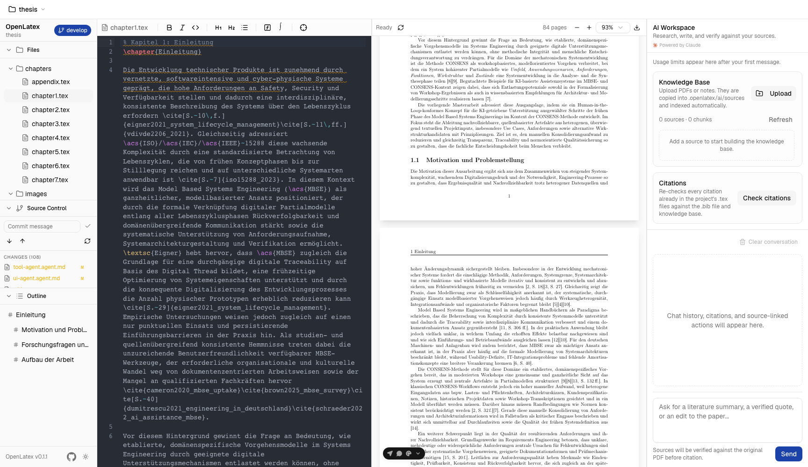

# OpenLaTex

Local, filesystem-backed LaTeX editor with live preview and a built-in AI research assistant. Edit `.tex` projects on disk, auto-reload when external tools change files, preview compiled PDFs, and search/cite a knowledge base of your own PDFs — all in the browser.



## Why OpenLaTex?

I wanted a proper LaTeX editor that runs **locally** — no Overleaf, no cloud dependency, full control over my files. The key idea: because the editor works directly on the filesystem with live file watchers, you can use an LLM in VS Code (Copilot, Claude, etc.) to proofread or edit your `.tex` files and see the changes reload instantly in the editor and PDF preview. Meanwhile you can also use the LaTex editor and write your paper directly in the WebUI and it will sync with disk automatically. It turns your local dev environment into a LaTeX writing workflow where AI tools, version control, and the editor all work together seamlessly.

Git integration is built in so you can use the same version control workflow you already know — branch, commit, push, pull — making it straightforward to collaborate on research papers with other researchers, all without leaving your local setup.

On top of that, an AI research assistant (Claude, via the Claude Agent SDK) lives in a fourth panel: it can search a knowledge base built from your own uploaded PDFs, verify every quote against the actual source page before citing it, and write directly into your `.tex` files — with a hard guarantee that it never fabricates a citation.

## Background

OpenLaTex is a fork of [open-prism](https://github.com/assistant-ui/open-prism) (MIT), which was an AI-assisted, browser-storage-backed LaTeX editor using OpenAI, assistant-ui, and Upstash Redis for rate limiting. Documents lived in IndexedDB with no connection to the local filesystem.

The fork completely rearchitected the project into a **local-first, filesystem-backed editor** designed to run alongside VS Code on the same `.tex` project directory. Here's what changed:

### What was removed
- **All AI integration** — OpenAI SDK, assistant-ui chat interface, AI drawer, rate limiting, Upstash Redis
- **Browser storage** — IndexedDB document store replaced with real filesystem operations
- **Cloud dependencies** — No API keys, no hosted services, no deployment concerns

### What was added (initial rearchitecture)
- **Filesystem layer** — Chokidar file watcher with SSE streaming, sandboxed path resolution, echo suppression for write-through edits
- **Disk-backed editing** — Every keystroke debounce-writes to disk (300ms); every external file change auto-reloads the editor buffer with cursor preservation
- **Git integration** — Branch indicator, file status colors (VS Code-style), Source Control panel with stage/unstage/commit/pull/push
- **Three Zustand stores** replacing the single document store — `fs-store` (file tree), `editor-store` (active file + buffer), `pdf-store` (compile output), plus `git-store`
- **Recursive file tree sidebar** with collapsible panels (Files, Source Control, Outline)
- **Table of Contents** parsed from LaTeX section commands, linked to PDF page navigation
- **Cached PDF** on startup — skips recompilation if the cached PDF is newer than all source files
- **Compile-from-disk** — The compile route reads source files from the project directory instead of receiving them from the browser
- **Security hardening** — Path sandboxing (`resolveInProject`), `execFile` instead of `exec` for Git commands, `.openlatex/` build directory with auto-generated `.gitignore`

### What was added since (AI, reintroduced from scratch)
AI came back later as a genuinely different feature, not a restoration of what was removed: a local knowledge base built from your own uploaded sources, verified against those sources rather than the model's own memory, running on the Claude Agent SDK instead of the original OpenAI/assistant-ui stack. See **AI Research Assistant** under Features below for the full picture — knowledge base search, citation verification, SyncTeX-style click-to-jump between source and PDF, GitHub sign-in/publish, and a colored Git UI all landed after the initial rearchitecture.

### What was kept
- **CodeMirror 6 editor** with LaTeX syntax highlighting and one-dark theme
- **react-pdf preview** with zoom controls
- **latex-api backend** (Hono + pdflatex) — completely unchanged from the original
- **shadcn/ui component library**, Tailwind CSS, Next.js framework

## Features

### Editor
- **CodeMirror 6** — LaTeX syntax highlighting, one-dark theme, undo/redo history
- **Formatting toolbar** — Bold, italic, headings, lists, code, images, colors
- **Find & replace** — `Ctrl+F` / `Cmd+F` search panel with match navigation
- **Sticky section headers** — Shows current `\section` / `\begin{...}` context at the top of the editor
- **Image preview** — Click a `.png` / `.jpg` / `.jpeg` to view it inline with zoom controls
- **Debounced write-through** — Every edit saves to disk within 300ms

### PDF Preview
- **Live auto-compile** — PDF rebuilds automatically when any source file changes (500ms debounce)
- **Zoom controls** — 50% to 400% scale, plus increment/decrement buttons
- **Scroll sync** — Table of Contents clicks scroll the PDF to the matching page via outline map
- **SyncTeX** — Double-click a spot in the compiled PDF to jump to that exact line in the source; the reverse (source → PDF highlight) is wired up too, with SyncTeX data registered and cached per build
- **Compile error log** — Collapsible build output panel shows `pdflatex` errors; previous PDF stays visible
- **Download** — One-click PDF download from the toolbar
- **Cached PDF** — On startup, loads the last-compiled PDF instantly if it's still fresh

### AI Research Assistant
A fourth panel powered by Claude (Claude Agent SDK), scoped entirely to your project directory — no cloud document store, everything lives in `.openlatex/ai/`.

- **One continuing conversation per project** — no conversation picker to manage; it just resumes, across page reloads and app restarts, via a persistent Claude Agent SDK session. "Clear conversation" starts a genuinely fresh one when you want it.
- **Knowledge base** — Upload PDFs, Markdown, or plain text. Each source is chunked, embedded locally (`@huggingface/transformers`, no external embedding API), and combined with a hand-rolled BM25 index for hybrid semantic + keyword search.
- **Verified metadata, never invented** — Title/author/year are resolved in order of trust: a real match against the [CrossRef](https://www.crossref.org/) bibliographic database, then the PDF's own embedded metadata, then a page-layout heuristic (font size, byline position) — and every field is tagged with exactly how confident that source is, down to the individual field. A heuristic guess can never silently become part of a citation. Metadata can also be corrected by hand from the source list.
- **Citation safety** — Every claim the assistant makes from a source is checked with `cite()` against the source's actual page text before it's allowed to appear as a citation — including when it writes `\cite[p.~<page>]{key}` directly into your `.tex` file, always with the exact page it just verified.
- **Citation audit** — A "Check citations" action re-scans every `\cite`/`\citep`/`\citet`/`\parencite`/`\autocite`/`\textcite` already in your `.tex` files and flags anything broken: a missing `.bib` entry, a page beyond the source's real length, a `.bib` entry with no linked source, or a citation missing a page.
- **Research notes** — The assistant can save its own synthesized understanding back into the knowledge base for later turns to build on — searchable, but never itself citable; every claim still traces back to a fresh `cite()` against a primary source.
- **Source management** — Search and sort the source list, a "needs review" filter for sources with unverified metadata, multi-select bulk delete, and duplicate-upload detection (exact-hash rejection, near-duplicate-title warning).
- **Plan usage** — The Current Session (5-hour) and Weekly Limits (7-day) usage cards match the Claude app's own usage view, backed by the Claude Agent SDK's usage API.
- **No fixed "mode"** — There's no Research/Write/Organize picker; the assistant reads each request and decides whether it's a search, an edit to the `.tex` files, or both.

### Sidebar
- **Recursive file tree** — Expandable directories, file icons by type, click to open
- **Table of Contents** — Parsed from `\part`, `\chapter`, `\section`, `\subsection`, `\subsubsection` in the active file; click to scroll the PDF
- **Collapsible panels** — Files, Source Control, Outline, and AI Workspace panels resize and collapse independently

### Git Integration
- **Auto-detection** — Detects if the open project folder is a Git repository on startup; entirely optional — the app works fully without Git, and initializing a repo is an explicit opt-in action
- **Colored branch indicator** — Current branch name shown as a colored pill (accent color, not plain text), with ahead/behind counts as icon+number badges inside it
- **File status colors** — VS Code-style decorations in the file tree:
  - Yellow = modified (unstaged), Green = staged, Dark green = untracked, Red = deleted/conflict
  - Single-letter badges: `M`, `A`, `?`, `D`, `C`, `R`
  - Directories inherit the most severe child status
- **Source Control panel** — Staged Changes, Changes, and Untracked sections with per-file stage/unstage buttons
- **Commit** — Commit message input with Enter-to-commit
- **Pull / Push** — One-click buttons (shown when a remote is configured)
- **Commit history** — A VS Code Timeline-style list of past commits, connected by a colored graph line (same accent as the branch pill); expand a commit to see its changed files and view a diff
- **Live refresh** — Git status updates on every file change (debounced 1s) and polls every 3s for external git operations (`git reset`, `git stash`, etc.)
- **GitHub integration** — Sign in via the GitHub CLI (`gh`), publish a local repo straight to a new GitHub repository, and open the current repo on GitHub in one click

### Project Management
- **Welcome screen** — On first run, browse to an existing project folder or create a brand-new one from scratch (scaffolds a starter `main.tex`)
- **Project switcher** — Jump between recently-opened projects without restarting the app
- **Per-project AI workspace** — The knowledge base, conversation, and SyncTeX cache all live under that project's own `.openlatex/` directory, so switching projects switches the whole AI context with it

### Filesystem Sync
- **Disk is source of truth** — The editor never holds state that isn't on disk
- **Chokidar file watcher** — SSE stream pushes `add` / `change` / `unlink` events to the browser in real-time
- **External edit auto-reload** — When another tool (VS Code, CLI, Claude) edits a file, the editor reloads the buffer and preserves cursor position
- **Echo suppression** — Write-echo tracker (100ms window) prevents the editor's own saves from bouncing back through the watcher
- **Reconnect with backoff** — SSE disconnects retry at 1s → 2s → 5s → 5s; tree re-syncs on reconnect

### General
- **Dark / Light / System theme** — Cycle with the toggle in the sidebar footer, tinted with a single restrained accent color rather than pure grayscale
- **Resizable panels** — Four-pane layout (sidebar, editor, preview, AI workspace) with drag-to-resize handles
- **Swap editor ↔ preview** — Hover the divider and click the swap button
- **Keyboard shortcuts** — `Ctrl+S` compile, `Ctrl+F` find, standard undo/redo
- **Toast notifications** — Non-intrusive feedback for errors and git actions via Sonner

## Quick Start

```bash
# Install dependencies
pnpm install

# Start the LaTeX compiler service (in one terminal)
# Option A — Docker (recommended):
cd apps/latex-api && docker build -t latex-api . && docker run -p 3001:3001 latex-api

# Option B — Local TeX Live (requires pdflatex on your PATH):
# cd apps/latex-api && pnpm dev

# Start the editor (in another terminal)
pnpm dev:web

# Then open http://localhost:3000 — the welcome screen lets you pick an existing
# project folder or create a new one.
# (Optional) To bootstrap with an env var instead, copy .env.example and set PROJECT_DIR:
# cp apps/web/.env.example apps/web/.env.local
```

Open [http://localhost:3000](http://localhost:3000). On first run the welcome screen lets you browse to (or create) a project folder — your choice is saved to `~/.openlatex/config.json`. Keep VS Code open on the same project folder — edits in either tool flow to the other via filesystem watching.

The AI panel needs a Claude account authenticated via the Claude Agent SDK (the same auth Claude Code uses) — no separate API key to configure for the editor itself.

### Environment Variables

| Variable | Required | Default | Description |
|----------|----------|---------|-------------|
| `PROJECT_DIR` | No | — | Optional one-shot bootstrap: used once on first run if no config exists, then ignored |
| `LATEX_API_URL` | No | `http://localhost:3001` | URL of the latex-api compilation service |

## Architecture

```
Browser (Next.js client)
  ├── File Tree ← fs-store (Zustand)
  ├── CodeMirror Editor ← editor-store (Zustand, debounced write-through)
  ├── PDF Preview ← pdf-store (Zustand, SyncTeX highlight/scroll)
  ├── Source Control ← git-store (Zustand, polls + event-driven)
  ├── AI Workspace ← ai-store (Zustand, SSE chat stream)
  └── GitHub account menu ← github-store (Zustand)
        │
        │  fetch() / SSE
        ▼
Next.js Server (apps/web)
  ├── /api/fs/*            — List, read, write-through, SSE watch
  ├── /api/compile         — Gathers sources, proxies to latex-api
  ├── /api/pdf/cached      — Serves cached PDF if fresh
  ├── /api/synctex/*       — Register/query SyncTeX mapping for a build
  ├── /api/git/*           — info, status, stage, unstage, commit, pull, push, log, show
  ├── /api/gh/*            — GitHub CLI auth status, publish, open-on-GitHub
  ├── /api/project/*       — current, set, browse, create
  ├── /api/ai/chat         — SSE chat stream (Claude Agent SDK, persistent session)
  ├── /api/ai/conversation — Get / clear the project's one conversation
  ├── /api/ai/sources/*    — Upload, list, edit metadata, bulk-delete knowledge sources
  ├── /api/ai/search       — Hybrid (semantic + BM25) knowledge-base search
  ├── /api/ai/citations/*  — Citation audit
  └── /api/ai/usage        — Claude plan usage (5-hour / weekly limits)
        │
        │  POST /builds/sync
        ▼
latex-api (apps/latex-api, Hono) — unchanged
  └── Spawns pdflatex / xelatex / lualatex, returns PDF bytes
```

### Security

- **Path sandboxing** — All filesystem operations validate paths via `resolveInProject()`, rejecting traversal (`..`), absolute paths, null bytes, and symlink escapes
- **No shell injection** — Git and GitHub CLI commands use `execFile` (args as array), not `exec`
- **`.openlatex/` build directory** — Auto-created with `.gitignore` containing `*` so build artifacts, the SyncTeX cache, and the AI knowledge base stay out of version control by default
- **Citation grounding** — The AI agent can only cite a quote it has independently verified against the source's own extracted text; it cannot cite a research note, and a source deleted mid-conversation is explicitly invalidated rather than silently trusted from memory

## Project Structure

```
OpenLaTex/
├── apps/
│   ├── web/                    # Next.js 16 frontend + API routes
│   │   ├── app/api/            # FS, Git, GitHub, Compile, PDF, SyncTeX, Project, AI routes
│   │   ├── components/         # UI (sidebar, editor, preview, ai, shadcn/ui)
│   │   ├── hooks/               # use-fs-startup, use-keyboard-shortcuts, use-current-project
│   │   ├── lib/fs/              # Sandbox, echo suppression, watcher, clients
│   │   ├── lib/git/             # Git runner (server), Git client (browser)
│   │   ├── lib/ai/              # Knowledge base, CrossRef lookup, citation audit, chat agent
│   │   ├── stores/              # Zustand: fs, editor, pdf, git, ai, github
│   │   └── styles/              # Tailwind CSS v4
│   └── latex-api/               # Hono API — spawns pdflatex (unchanged from fork)
├── docs/                        # Design specs and plans
├── biome.json                   # Biome linter
└── turbo.json                   # Turborepo config
```

## Tech Stack

| Layer | Technology |
|-------|-----------|
| Framework | Next.js 16, React 19 |
| Editor | CodeMirror 6, codemirror-lang-latex |
| PDF | react-pdf, pdfjs-dist (also used for SyncTeX page/position mapping) |
| State | Zustand 5 |
| UI | shadcn/ui (Radix UI), Tailwind CSS v4, Lucide icons |
| File watching | chokidar 4 |
| AI | Claude Agent SDK (`@anthropic-ai/claude-agent-sdk`), local embeddings via `@huggingface/transformers`, hand-rolled BM25, CrossRef REST API for metadata verification |
| Compiler backend | Hono, pdflatex / xelatex / lualatex |
| Build | Turborepo, pnpm workspaces, TypeScript (strict) |
| Testing | Vitest |

## Contributing

See [CONTRIBUTING.md](./CONTRIBUTING.md) for development setup and contribution guidelines.

## License

[MIT](./LICENSE)
